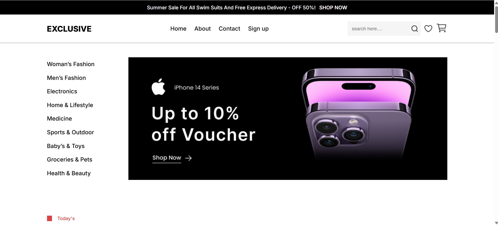
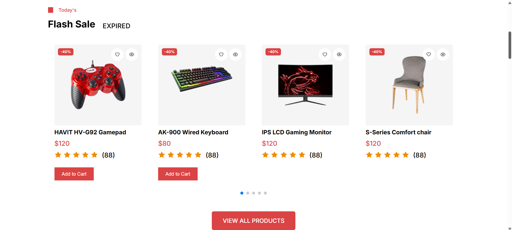

The Ecommerce Website Design is an e-commerce website focused on interface design, delivering a visually appealing and user-friendly online shopping experience. The website is built primarily with HTML, CSS, and a touch of JavaScript to create a responsive interface and basic interactions.
Preview of this website:
 
 
 
 

